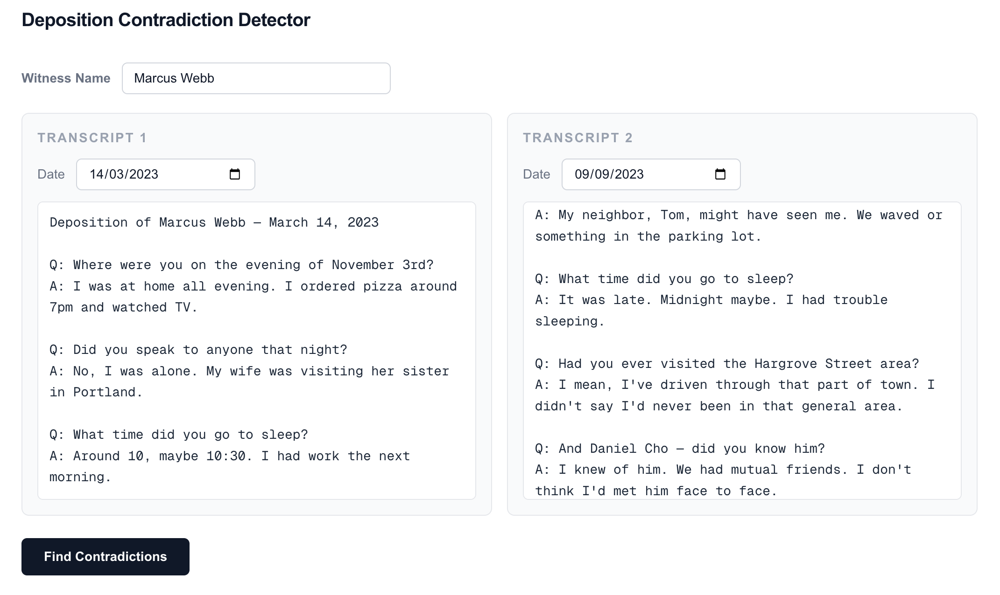
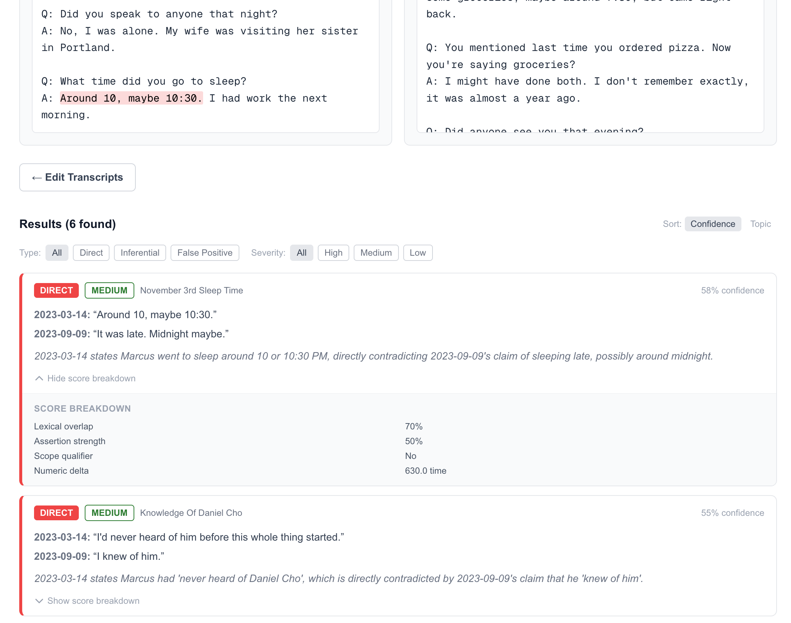

# Deposition Contradiction Detector

A web application that helps legal professionals detect contradictions between deposition transcripts from the same witness. Paste two transcripts, click **Find Contradictions**, and get a structured, scored list of inconsistencies — color-coded by type and severity.

## How it works

1. **Input** — paste two transcripts with witness name and date for each.
2. **Analysis** — the app sends the transcripts through a three-pass pipeline: claim extraction (LLM), claim pairing (LLM), and deterministic scoring (application code — no LLM).
3. **Results** — contradictions are displayed with type, severity, confidence score, relevant quotes, and an explanation. Click any contradiction to highlight the matching quotes in both transcripts.

### Input



### Results



## Contradiction types

| Type | Color | Meaning |
| --- | --- | --- |
| `DIRECT` | Red | One claim directly negates the other |
| `INFERENTIAL` | Amber | Both claims could be true alone but cannot both hold simultaneously |
| `FALSE_POSITIVE` | Gray | Likely imprecise language, not a real conflict |

## Run

```bash
yarn dev
```

Open [http://localhost:3000](http://localhost:3000).

Requires a `GEMINI_API_KEY` in `.env`:

```env
GEMINI_API_KEY=your_key_here
```

## Build

```bash
yarn build
yarn start
```
